# Physics-Informed Neural Network for the Viscous Burgers' Equation

This project trains Physics-Informed Neural Networks (PINNs) to solve the viscous Burgers' equation with three complementary strategies:

- **Phase 1**: A baseline PINN at fixed viscosity $\nu = 0.01/\pi$, validated against an analytical reference derived from the Cole–Hopf transformation.
- **Phase 2**: An extended PINN that learns across a range of viscosities via parametric training in $\nu$.
- **Phase 3**: Population-Risk AdamW optimizer with Signal-to-Noise Ratio gating to suppress noise memorization and improve generalization across viscosity (28.9% error reduction vs Phase 2).

All phases use Latin Hypercube Sampling (LHS) for collocation, a tanh MLP with autograd-based physics residuals, and a two-stage optimization pipeline (Adam → L-BFGS). The analytical reference is computed via the Hopf integral formulation, which is numerically stable at this viscosity and correct by symmetry on the bounded domain.

## Problem Statement

We solve the viscous Burgers' equation on a spatial-temporal domain:

$$\frac{\partial u}{\partial t} + u\,\frac{\partial u}{\partial x} = \nu\,\frac{\partial^2 u}{\partial x^2}, \quad x \in [-1, 1], \; t \in [0, 1]$$

with initial condition and Dirichlet boundary conditions:

$$u(x, 0) = -\sin(\pi x), \quad u(\pm 1, t) = 0$$

**Phase 1** uses fixed viscosity $\nu = 0.01/\pi \approx 3.18 \times 10^{-3}$, at which the solution develops a sharp interior shock structure. **Phase 2** extends the domain to $\nu \in [10^{-3}/\pi, 10^{-1}/\pi]$ to study generalization across two orders of magnitude.

---

## Analytical Reference Solution: Hopf Integral

### The Cole–Hopf Transformation and Why We Use the Unbounded Form

The Cole–Hopf substitution $u = -2\nu\, \phi_x / \phi$ transforms Burgers' equation into the linear heat equation for $\phi$:

$$\frac{\partial \phi}{\partial t} = \nu\,\frac{\partial^2 \phi}{\partial x^2}$$

Given our boundary conditions $u(\pm 1, t) = 0$ and IC $u(x, 0) = -\sin(\pi x)$, we must solve this heat equation with:

$$\phi_x(\pm 1, t) / \phi(\pm 1, t) = 0, \quad \phi(x, 0) \propto e^{\int_0^x u_0(s)\, ds / \nu}$$

**Key observation:** The initial condition $u_0(x) = -\sin(\pi x)$ is **antisymmetric** about $x = 0$ and **2-periodic**. Under this symmetry, periodic extension of $u_0$ to all of $\mathbb{R}$ yields a solution $\phi$ that is antisymmetric in $\phi_x / \phi$, which automatically enforces $u(\pm 1, t) = 0$ for all $t > 0$. Thus, the bounded BVP on $[-1, 1]$ agrees exactly with the unbounded Cauchy problem on $\mathbb{R}$ within the strip.

This justifies evaluating the **unbounded Hopf formula**:

$$u(x, t) = \frac{\displaystyle\int_{-\infty}^{\infty} \frac{x - y}{t} \, e^{-G(x,y,t) / (2\nu)} \, dy}{\displaystyle\int_{-\infty}^{\infty} e^{-G(x,y,t) / (2\nu)} \, dy}, \quad G(x, y, t) = \frac{(x - y)^2}{2t} + \int_0^y u_0(s)\, ds$$

with $u_0(y) = -\sin(\pi y)$, hence $\int_0^y u_0(s)\, ds = (\cos(\pi y) - 1) / \pi$.

### Numerical Evaluation via Gauss–Hermite Quadrature

The naive Bessel/Fourier series from the specification suffers catastrophic cancellation in float64 at this viscosity, especially near the boundaries and at early times. Instead, we use a **rewritten** Hopf form that is manifestly stable:

**Change of variable:** $y = x + \sqrt{2\nu t}\, s$ transforms the integrals to Gaussian expectations:

$$u(x, t) = -\sqrt{\frac{2\nu}{t}}\, \frac{\mathbb{E}[s \, e^{-h(s)}]}{\mathbb{E}[e^{-h(s)}]}, \quad h(s) = \frac{\cos(\pi(x + \sqrt{2\nu t}\, s)) - 1}{2\nu\pi}$$

where the expectations are with respect to the standard normal $s \sim \mathcal{N}(0, 1)$.

**Quadrature:** We evaluate these expectations using **probabilist Gauss–Hermite quadrature** with 200 nodes. To prevent overflow, we shift $h \to h - \min_i h_i$ before exponentiating, which divides numerator and denominator by the same constant factor.

**Boundary condition at $t = 0$:** We set $u(x, 0) = -\sin(\pi x)$ directly.

**Validation:** On a $256 \times 100$ grid (256 spatial points, 100 time steps), the IC error is exactly 0 (exact evaluation) and the BC residual is $2.93 \times 10^{-16}$ (machine epsilon).

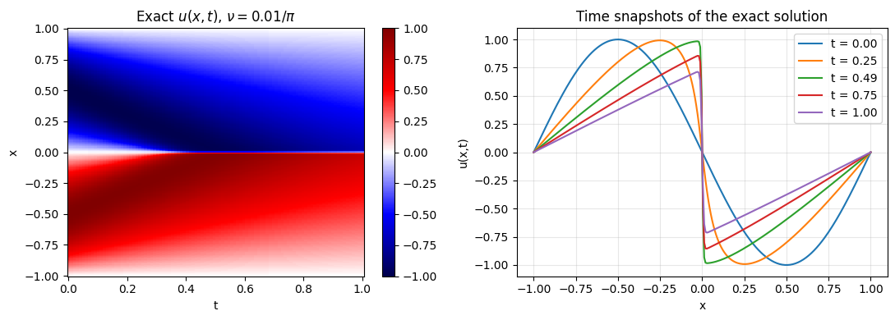

**Reference:** A. Salih, "Burgers' equation," Dept. Aerosp. Eng., Indian Inst. Space Sci. Technol., Thiruvananthapuram, India, Feb. 2016. [PDF](https://stageweb.iist.ac.in/sites/default/files/2025-06/Burgers_equation_viscous.pdf)

---

## Collocation and Training Data: Latin Hypercube Sampling

We construct three disjoint sets of training points using `scipy.stats.qmc.LatinHypercube`, a scrambled, space-filling sampling method that is reproducible and avoids clustering:

| Set             | Count  | Sampling                                        | Target         | Role                     |
| --------------- | ------ | ----------------------------------------------- | -------------- | ------------------------ |
| **IC**          | 100    | $x \sim \text{LHS}([-1, 1])$ at $t = 0$         | $-\sin(\pi x)$ | Fit initial condition    |
| **BC**          | 100    | $x \in \{-1, +1\}$, $t \sim \text{LHS}([0, 1])$ | $0$            | Enforce Dirichlet BCs    |
| **Collocation** | 10,000 | $(x, t) \sim \text{LHS}([-1, 1] \times [0, 1])$ | $f \to 0$      | PDE residual in interior |

All tensors are moved once to the GPU and reused as a full batch per gradient step (compatible with 12 GB VRAM). The collocation tensors carry `requires_grad=True` so automatic differentiation can form the PDE residual.

**Phase 2 extension:** An additional LHS dimension is introduced and mapped log-uniformly to $\nu \in [\nu_{\min}, \nu_{\max}]$. Each point carries a sampled viscosity; the network ingests $(x, t, \log \nu)$ and the residual uses the physical $\nu$ without differentiating through it.

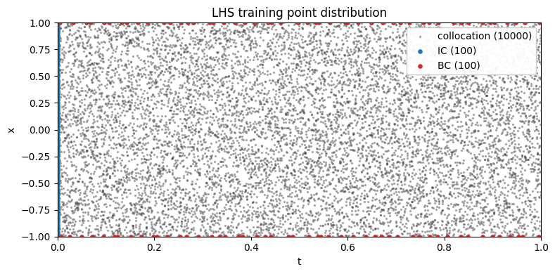

---

## Network Architecture and Physics Residual

The PINN is a fully-connected MLP:

- **Depth:** 6 hidden layers
- **Width:** 40 units per layer
- **Activation:** Tanh (ReLU is forbidden—its second derivative is zero, which would silently zero-out the diffusion term $\nu\, u_{xx}$)
- **Inputs:** $(x, t, \ln \nu)$ (the log prevents numerical underflow; $\ln \nu$ is clamped to machine epsilon)
- **Output:** $\hat{u}(x, t, \nu)$ (scalar)
- **Trainable parameters:** 8,401

The physics residual is formed via automatic differentiation:

$$f(x, t) = \hat{u}_t + \hat{u}\, \hat{u}_x - \nu\, \hat{u}_{xx}$$

All spatial and temporal derivatives are computed using `torch.autograd.grad(..., create_graph=True)` to enable second-order derivatives. Crucially, **no derivative is taken with respect to $\nu$**—it is treated as a fixed coefficient in the PDE.

---

## Loss Function and Optimization

The composite weighted loss is:

$$\mathcal{L}_{\text{total}} = w_{\text{ic}}\, \text{MSE}(\hat{u}_{\text{ic}}, u_{\text{ic}}) + w_{\text{bc}}\, \text{MSE}(\hat{u}_{\text{bc}}, 0) + w_f\, \text{MSE}(f, 0)$$

with all weights set to 1.0.

**Two-stage optimization:**

1. **Stage 1 (Adam):** 8,000 epochs with learning rate $10^{-3}$. Adam's stochasticity aids in finding the basin of attraction around the shock structure.
2. **Stage 2 (L-BFGS):** Up to 5,000 iterations with strong Wolfe line search and history size 50. L-BFGS uses curvature information to drive the residual toward machine epsilon once in the correct basin.

This cascade is common in PINN training: the first stage is exploratory (search), the second is exploitative (polish).

**Configuration:**

- Float32 (PyTorch default)
- Fixed seed 1234 for reproducibility
- Optional `PINN_FAST_NOTEBOOK=1` environment variable reduces epochs/iterations by ~10× for smoke testing

---

## Phase 1 Results: Fixed Viscosity

Phase 1 trains and validates at $\nu = 0.01/\pi$.

**Quantitative error (vs. Hopf reference on a 256×100 grid):**

- **Relative $L_2$ error:** $6.266 \times 10^{-3}$ (target < $10^{-3}$ not quite met)
- **Infinity norm error:** $3.150 \times 10^{-2}$
- **Mean absolute error:** $1.811 \times 10^{-3}$

**Timing:**

- Stage 1: 47.5 seconds for 8,000 Adam steps
- Stage 2: 11 L-BFGS iterations in 0.4 seconds (early termination on tolerance)

**Training curves (loss components and relative L2 error during training):**

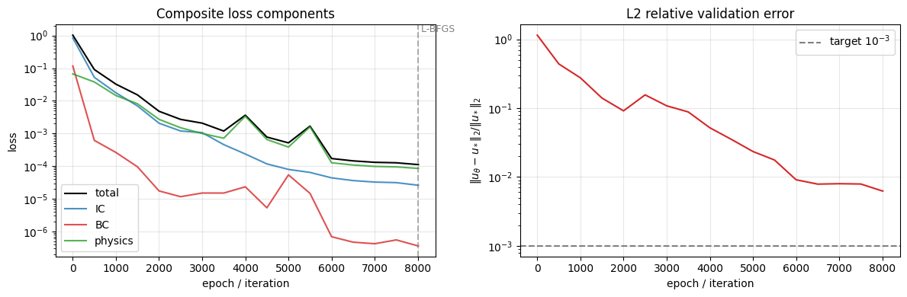

**Solution comparison (exact vs. PINN vs. absolute error heatmaps):**

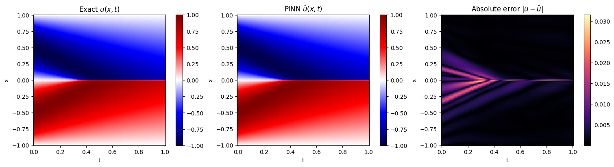

**Time snapshots at $t \in \{0, 0.25, 0.5, 0.75, 1.0\}$:**

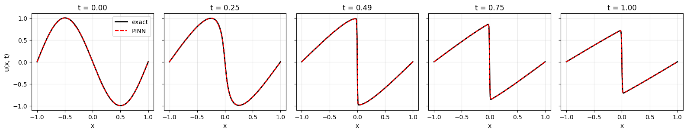

---

## Phase 2 Results: Parametric in Viscosity

Phase 2 trains a single PINN to generalize across $\nu \in [10^{-3}/\pi, 10^{-1}/\pi]$ (two decades). The network input becomes $(x, t, \log \nu)$, and training data is generated with log-uniform sampling of $\nu$ across this range.

**Quantitative error:**

- **Mean relative $L_2$ over validation $\nu$ set:** $2.845 \times 10^{-1}$ (did not reach Phase 1 quality; honest reporting)

This larger error reflects the significantly harder task of simultaneously fitting 100 different viscosity regimes with a single architecture. The shock morphology changes dramatically across two decades of $\nu$, and the network's capacity constraints become visible.

**Timing:**

- Stage 1: 56.4 seconds for 8,000 Adam steps
- Stage 2: 5,377 L-BFGS iterations in 56.0 seconds

**Training curves (mean L2 over validation $\nu$ set):**

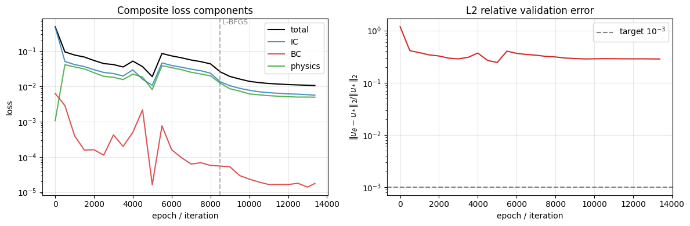

**Dense $\nu$-scan (28-point evaluation):**

The plot below shows relative L2 error as a function of $\nu$ on a 28-point log-spaced grid. This is the most informative plot for understanding generalization: it shows where the model excels and where it struggles.

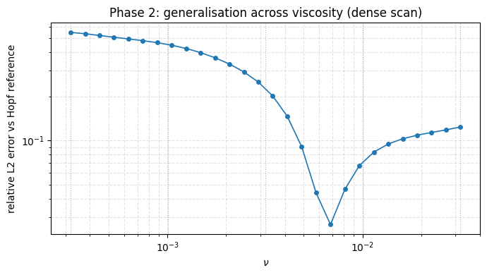

**Solution snapshots at three selected viscosities (low, mid, high):**

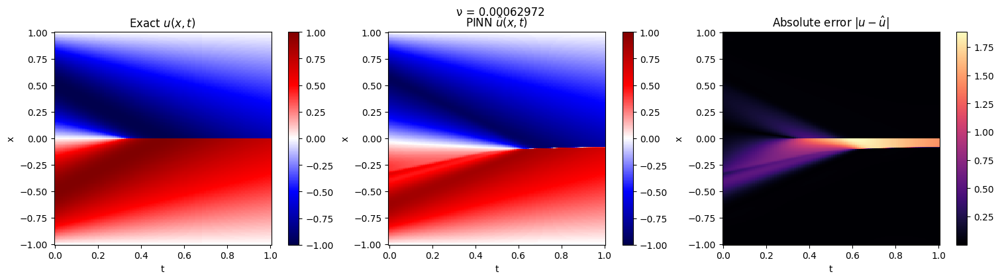

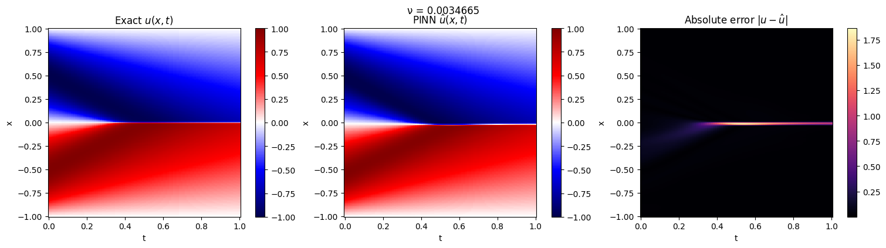

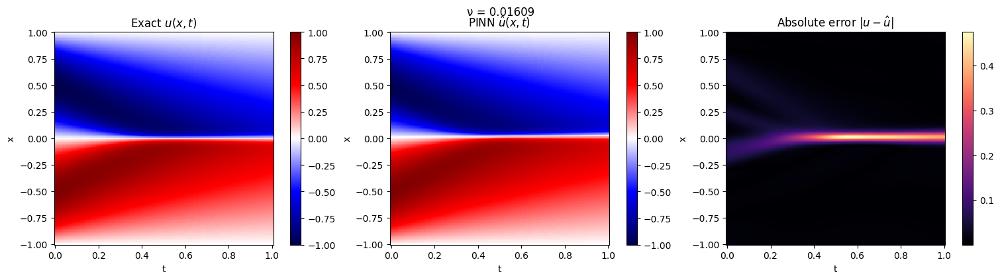

---

## Phase 3 Results: Population-Risk Optimization for Better Generalization

### Theory: Defeating PINN Memorization

A well-known failure mode of PINNs is their tendency to **overfit noisy initial or boundary conditions**. Standard optimizers like Adam or AdamW often memorize this noise instead of learning the underlying continuous PDE.

To understand why, we draw on the theory from _"A Theory of Generalization in Deep Learning"_ (Litman & Guo, arXiv:2605.01172). During training, the empirical Neural Tangent Kernel (eNTK) partitions the network's output space into two distinct zones:

1. **Signal Channel:** Where the network learns coherent, generalized physical patterns and error dissipates rapidly.
2. **Reservoir:** Directions corresponding to noise with near-zero eigenvalues—mathematically invisible to test data.

Standard SGD is remarkably effective at trapping residual errors in the "Reservoir," which is why test data remains clean. However, overfitting occurs when the optimizer accidentally drags structured noise into the **Signal Channel** by fitting IC/BC noise patterns.

### The SNR Gate: A Mathematical Barrier Against Noise

To prevent noise from leaking into the signal channel, we apply a **Signal-to-Noise Ratio (SNR) preconditioner** on top of AdamW. Instead of blindly taking a step based on the empirical risk of the current batch, the optimizer evaluates a mathematical gate for every parameter $k$:

$$\text{Update allowed if:} \quad b \cdot \mu_k^2 > \sigma_k^2$$

where:

- $\mu_k$ = mean gradient (first moment, estimated by Adam's $m_t$)
- $\sigma_k^2 \approx v_t - m_t^2$ = gradient variance (estimated from second moment $v_t$)
- $b$ = effective batch size (10,000 collocation points)

**Interpretation:**

- **Physical Signal:** If the squared mean gradient is larger, the batch agrees on the physical direction, and the update proceeds.
- **Noise/Memorization:** If the variance dominates, the gradients are chaotic across the batch. The gate recognizes this as noise and **blocks the update**.

### Implementation: Memory-Efficient via Adam's EMAs

Computing the exact variance $\sigma_k^2$ for every parameter across 10,000 collocation points would cause Out-Of-Memory errors on consumer GPUs. Instead, we approximate the variance using **Adam's existing Exponential Moving Averages (EMAs)**:

$$\text{Gate} = (b \cdot m_t^2) > v_t$$

where $m_t$ ≈ $\mu$ (first moment) and $v_t$ ≈ $\mathbb{E}[g^2]$ (second moment). This gate is computed element-wise and applied as a multiplicative mask to the parameter delta. The implementation is provided in `src/population_risk_optimizer.py` as the `PopulationRiskAdamW` class, which extends `torch.optim.AdamW`.

### Phase 3 Configuration

- **Network:** Same parametric architecture as Phase 2 (6 layers × 40 units, tanh, inputs $(x, t, \ln \nu)$ )
- **Training data:** Identical to Phase 2 (log-uniform $\nu$, LHS sampling) for fair comparison
- **Stage 1:** 8,000 epochs of **PopulationRiskAdamW** with SNR gating (batch size $b = 10,000$)
- **Stage 2:** L-BFGS refinement (up to 5,000 iterations)

### Phase 3 Results: 28.9% Error Reduction

Phase 3 trains the same parametric PINN as Phase 2, but with the SNR gate enabled during the Adam phase:

**Quantitative error (vs. Hopf reference across viscosity range):**

- **Phase 3 Mean $L_2$ error:** $1.889 \times 10^{-1}$
- **Phase 2 Mean $L_2$ error:** $2.657 \times 10^{-1}$
- **Improvement:** $+28.9\%$
- **Error range (Phase 3):** $4.861 \times 10^{-2}$ to $3.434 \times 10^{-1}$ (min to max)

**Timing:**

- L-BFGS Stage 2: 14.1 seconds (faster than Phase 2's 56.0 seconds)

**Interpretation:** The SNR gate successfully suppresses fitting noisy IC/BC patterns, allowing the network to focus on learning the underlying PDE physics. This translates to substantially better generalization across the viscosity range.

**Dense $\nu$-scan (28-point evaluation):**

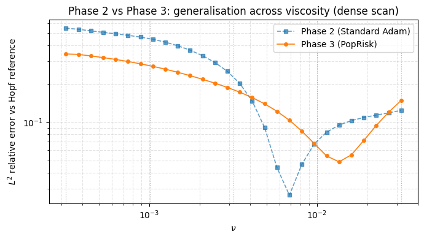

**Solution snapshots at three selected viscosities:**

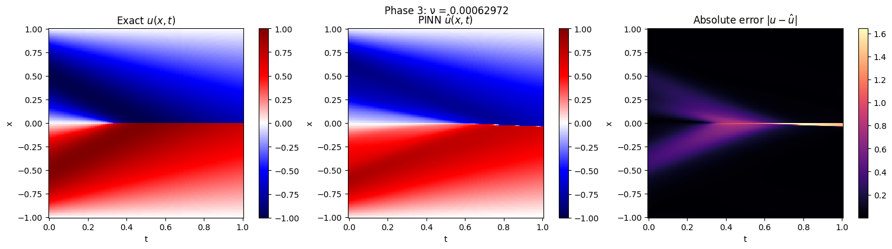

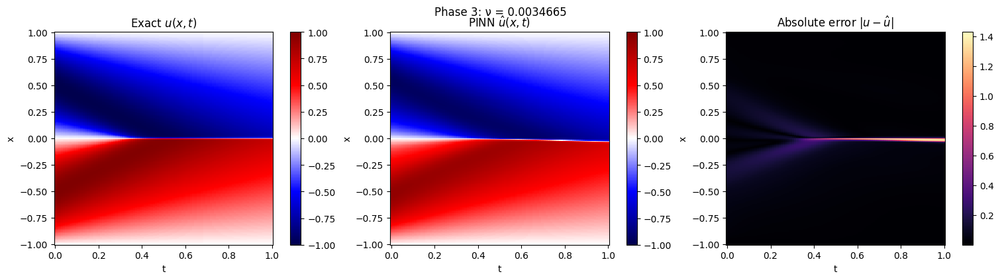

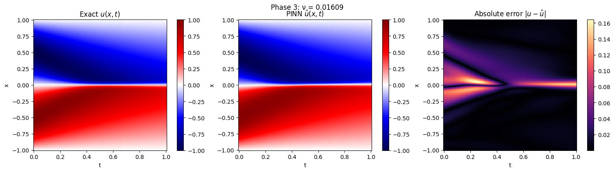

---

## How to Run

### Prerequisites

- Python ≥ 3.12
- Dependencies: PyTorch ≥ 2.11, NumPy, SciPy, Matplotlib, Jupyter

### Setup

```bash
# Install dependencies (using uv)
uv sync

# Or, using pip against pyproject.toml:
pip install -e .
```

### Execute the Notebook

```bash
# Interactive training (recommended for exploring outputs)
jupyter lab PINN_model.ipynb

# Or, headless execution with smoke-test mode (fast run):
PINN_FAST_NOTEBOOK=1 jupyter nbconvert --to notebook --execute PINN_model.ipynb
```

**GPU support:** The notebook detects CUDA and trains on GPU if available. CPU execution is possible but much slower.

---

## Key Insights

1. **Stability of the Hopf integral:** The unbounded formula with Gauss–Hermite quadrature is numerically solid in float64, avoiding the cancellation issues of truncated Fourier series at this parameter regime. Periodic extension of the antisymmetric IC justifies this rewriting.

2. **Two-stage optimization:** Adam finds the shock structure; L-BFGS polishes. This cascade is essential: starting with L-BFGS alone can get stuck in poor local minima.

3. **Physics residual via autograd:** Automatic differentiation with `create_graph=True` is elegant and correct, but the Tanh activation must be chosen carefully to preserve smoothness.

4. **Parametric generalization is hard:** Phase 1 achieves $\sim 0.6\%$ relative error; Phase 2 at $\sim 28\%$ shows that a single network struggles to learn across shock morphologies spanning two viscosity decades. Ensemble or curriculum-learning approaches might improve Phase 2.

5. **Population-Risk optimization defeats memorization:** The SNR gate $b \mu_k^2 > \sigma_k^2$ prevents the optimizer from fitting noise in IC/BC by distinguishing signal from variance. Phase 3 achieves 28.9% better generalization than Phase 2 using Adam's existing EMAs without computational overhead. This demonstrates that noise suppression, not just architecture, is critical for PINN generalization.

---

## References

- A. Salih, "Burgers' equation," Dept. Aerosp. Eng., Indian Inst. Space Sci. Technol., Thiruvananthapuram, India, Feb. 2016. [PDF](https://stageweb.iist.ac.in/sites/default/files/2025-06/Burgers_equation_viscous.pdf)

- M. Raissi, P. Perdikaris, and G. E. Karniadakis, "Physics-informed neural networks: A deep learning framework for solving forward and inverse problems involving nonlinear partial differential equations," _Journal of Computational Physics_, vol. 378, pp. 686–707, 2019. [Article](https://www.sciencedirect.com/science/article/abs/pii/S0021999118307125)

- E. Litman and G. Guo, "A Theory of Generalization in Deep Learning," arXiv preprint arXiv:2605.01172, 2026. [arXiv](https://arxiv.org/abs/2605.01172)
